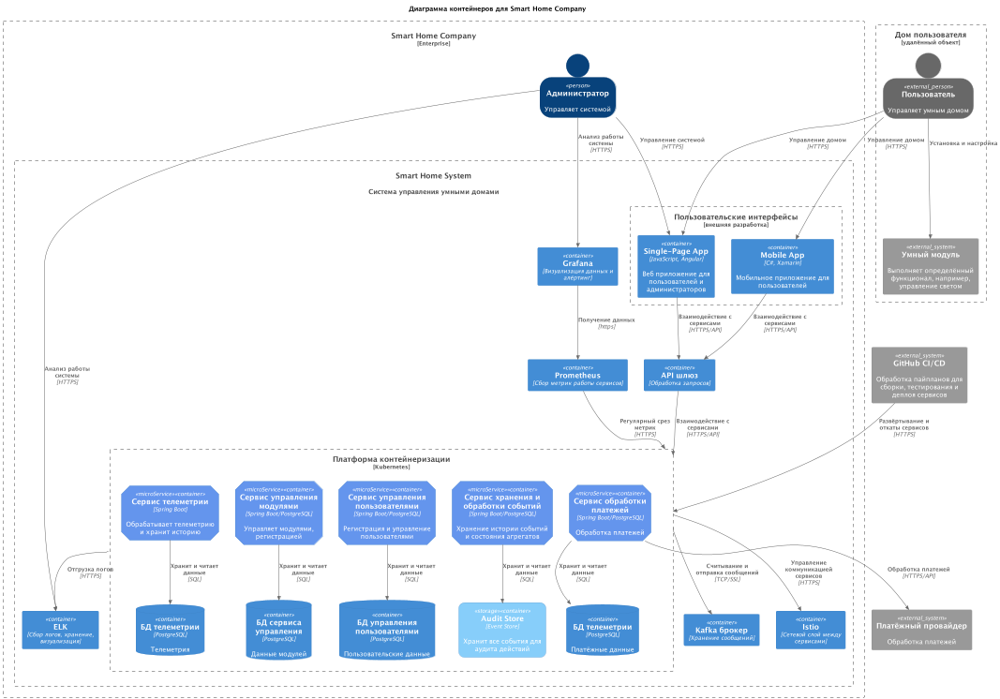

# Подзадание 1.2: Архитектура микросервисов

На диаграмме предствлена C4 Container диаграмма, учтены:

* средства CI/CD для автоматизации развёртывания
* API GW для аутентификации, авторизации, балансировки и консолидации регистрации сервисов
* Service Mesh для дополнительной безопасности и более гибкого управления сервисами
* ELK, Grafana, Prometheus для проактивного мониторинга и обработки данных в различных форматах

Допущения:

* На схеме отдельно не отражены группы разработки, QA и DevOps, но предполагается их участие
* Для уменьшения числа связей и лучшей читабельности связи между API GW, брокером Kafka, системами мониторинга и сервисами объединены

Диаграмма:

