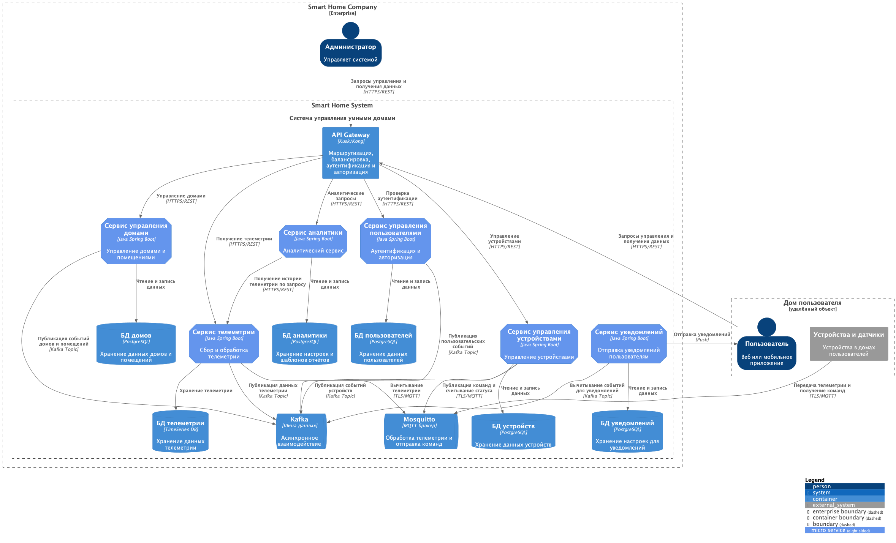
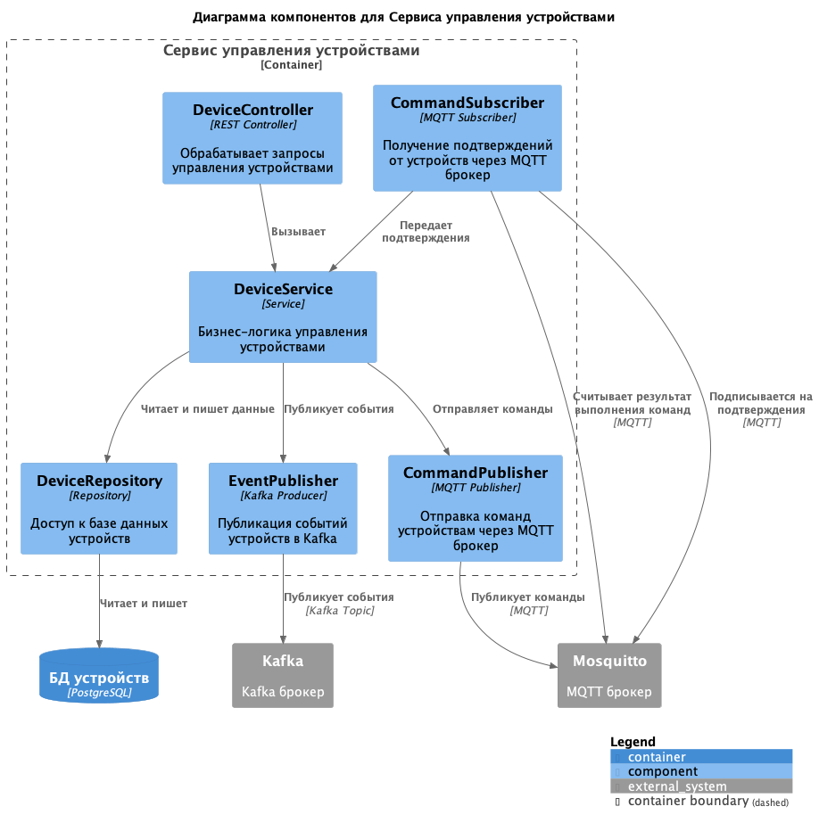
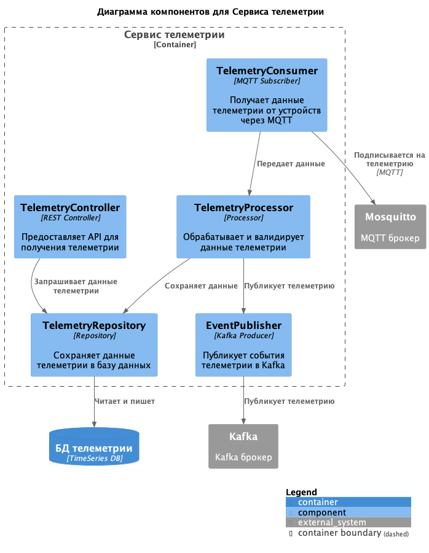
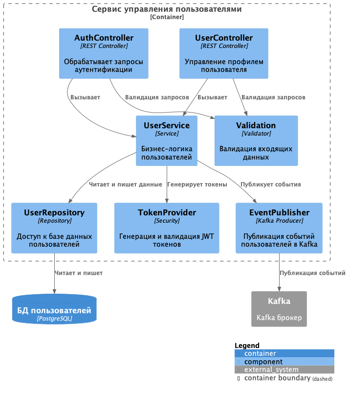
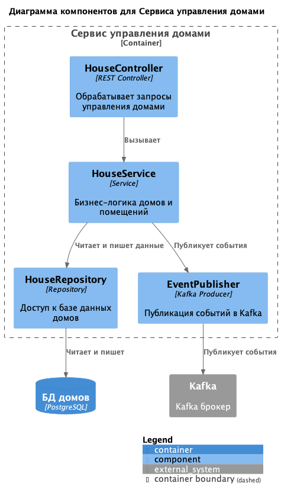
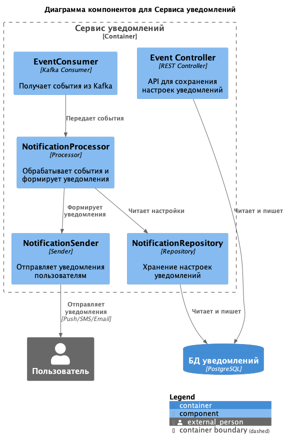
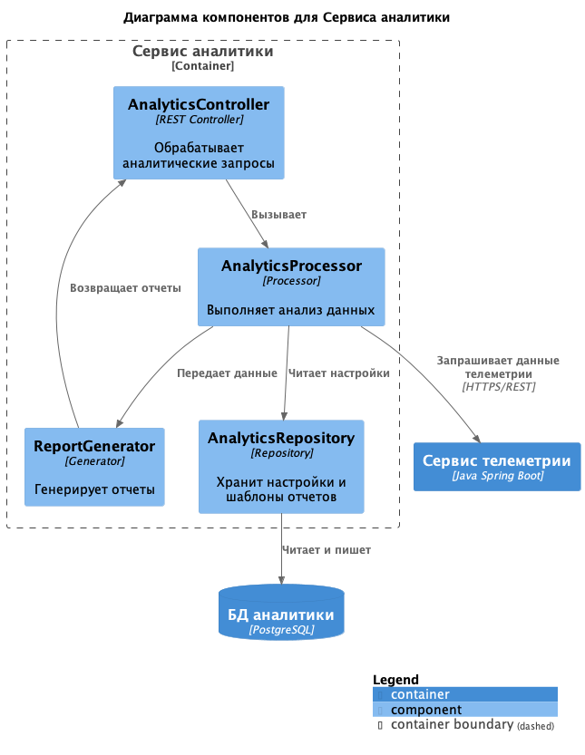

# Подзадание 1.2: Архитектура микросервисов

Исходя из выделенных доменов и границ контекстов, система разбивается на следующие микросервисы:

### Сервис управления устройствами (Device Management Service):
* Управление состоянием устройств (включение/выключение)
* Отправка команд на устройства
* Обработка ответов от устройств
###	Сервис телеметрии (Telemetry Service):
* Сбор и хранение данных телеметрии
* Обработка потоков данных
* Предоставление данных другим сервисам
### Сервис управления пользователями (User Management Service):
* Аутентификация и авторизация
* Управление профилями пользователей
* Контроль доступа к ресурсам
### Сервис управления домами и помещениями (House Management Service):
* Управление информацией о домах и помещениях
* Привязка устройств к помещениям
* Обработка сценариев автоматизации
### API Gateway:
* Единая точка входа для клиентов
* Маршрутизация запросов к соответствующим микросервисам
* Обеспечение безопасности и контроля доступа
### Шина данных (Kafka):
* Асинхронное взаимодействие между микросервисами
* Обеспечение масштабируемости и отказоустойчивости

Примечание:

* На схеме отдельно не отражены группы разработки, QA и DevOps, но предполагается их участие в настройке CI/CD и тестированиях
* Также для облегчения схемы не учтены CI/CD инструменты для автоматизации развёртывания в различных средах, а также ELK, Prometheus и Grafana для проактивного мониторинга работы системы
* Для повышения безопасности и гибкости в коммуникациях между сервисами также предполагается использования паттерна Service Mesh с использованием Istio

### Диаграмма контейнеров целевого решения:

### Диаграммы компонентов

